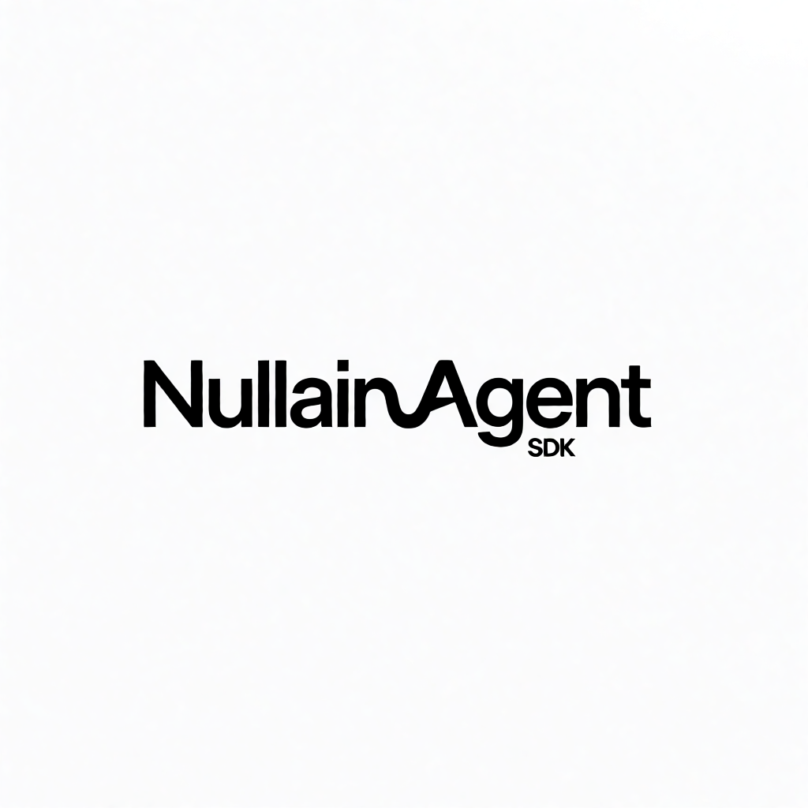
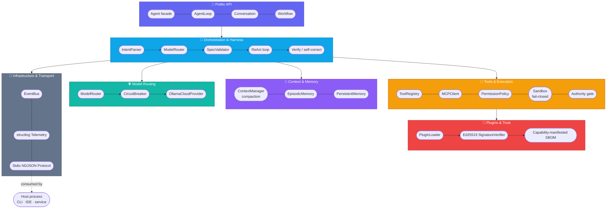

<div align="center">



# Nullain Agent SDK

**The Production-Grade Autonomous Agent Engine & SDK for Python**

[](https://github.com/netty-linux/nullain-agent-sdk/actions/workflows/ci.yml)
[](https://pypi.org/project/nullain-sdk/)
[](https://pypi.org/project/nullain-sdk/)
[](https://github.com/netty-linux/nullain-agent-sdk/blob/master/pyproject.toml)
[](https://www.python.org/downloads/)
[](https://github.com/microsoft/pyright)
[](https://github.com/astral-sh/ruff)
[](docs/architecture.md)
[](LICENSE)

**[English](README.md)** • [Português (Brasil)](README.pt-BR.md)

*Built for high-reliability software engineering workflows. Consumed by any host process — CLI, IDE extension, backend service — via a zero-drift NDJSON protocol over stdio.*

[Overview](#-overview) • [Features](#-features) • [Architecture](#-architecture) • [Quick Start](#-quick-start) • [Protocol & Daemon](#-protocol--daemon) • [Security](#-security--threat-model) • [Development](#-development)

</div>

---

## 📌 Overview

**Nullain Agent SDK** (`nullain`) is a production-grade agentic engine that reasons, executes code, self-corrects, and learns from experience across software development tasks.

It is built on **Hexagonal Architecture** (ports & adapters) and **Event Sourcing** — every interaction is a frozen, append-only event, state is derived by deterministic fold, and the boundary between "what the LLM decided" and "what actually ran" is explicit and auditable at every step.

The SDK ships as three packages in one workspace:

| Package | What it is |
|---|---|
| [`nullain-sdk`](nullain-sdk/) | The core engine — model routing, event sourcing, context management, memory, MCP client, subagent authority, plugins, sandboxing, and the workflow orchestrator. |
| [`nullain-tools`](nullain-tools/) | Built-in developer tools — paged file reads, safe edits, `ripgrep` search, shell execution, git, checkpoints/undo. |
| [`nullain-agentd`](nullain-agentd/) | A stdio NDJSON daemon that exposes the SDK to non-Python hosts (CLIs, IDE extensions, other services) with a versioned, schema-exported protocol. |

---

## ✨ Features

- 🧠 **Tiered Model Routing (`ModelRouter`)**
  Task classification routes requests to `fast`, `balanced`, or `deep` model tiers on Ollama Cloud, with circuit breakers and automatic fallback chains.
- 📜 **Immutable Event Sourcing (`Conversation`)**
  All interaction history is a frozen, append-only sequence of Pydantic events. State is derived via deterministic fold — replayable, zero-drift, fully auditable.
- 📐 **Plan/Act/Verify Loop (`AgentLoop`)**
  Structured pipeline: task-spec generation, strict validation, human approval gates, and a verification phase with self-correction on test or lint failure.
- 🛡️ **Context Compaction & Instruction Centrifugation (`ContextManager`)**
  Automatically compacts history at 75% window capacity while preserving active specs and key decisions, with instruction re-injection and progressive tool disclosure.
- 🧬 **Episodic Memory & Learning Loop (`EpisodicMemory`)**
  SQLite-backed trajectory engine that records execution attempts and repository fingerprints, injecting relevant few-shot examples into future tasks.
- 🔒 **Defense-in-Depth Security (`PermissionPolicy` + `Sandbox`)**
  No `shell=True`, ever — subprocess execution via explicit argument lists, strict path resolution, and 3-tier permissions (`allow` / `ask` / `deny`). Underneath that, an **OS-level fail-closed sandbox** (Landlock on Linux ≥5.13, Seatbelt on macOS, Job Object on Windows): if a required sandbox is unavailable, execution is **refused**, never run unsandboxed.
- 🪪 **Subagent Authority-Intersection Law (`Authority`)**
  A child subagent's effective authority is the **meet** of four factors — parent authority ∧ delegation ∧ child definition ∧ policy. A capability is granted only if all four grant it; any single denial removes it outright, with no `ASK` escape hatch.
- 📦 **Signed Plugins + SBOM (`PluginLoader`)**
  Plugins are signed, capability-manifested bundles. The signature covers identity, transport, capabilities, tool declarations, and a content-hashed SBOM — drift in any of them invalidates it. Verification is Ed25519, fail-closed at every branch.
- 🔎 **Deferred Tool Schemas**
  MCP tools register with minimal metadata; full input schemas hydrate on demand via a `search_tools` tool, keeping the prompt small as the tool surface scales.
- 🧩 **Deterministic Workflow Orchestrator (`Workflow`)**
  A workflow is a Python function that composes subagents deterministically — fan-out, pipelines, and ordering are fixed by the script, never decided by an LLM.
- ⚡ **Zero-Drift Stdio NDJSON Daemon (`nullain-agentd`)**
  A typed protocol with automated JSON Schema export (`make schema`), so any language can consume the SDK without hand-maintained bindings.

---

## 🏗️ Architecture



A full walkthrough of the six-phase run pipeline (Intent → Route → Plan → Act → Verify → Memory) lives in [docs/architecture.md](docs/architecture.md).

---

## 🚀 Quick Start

### Prerequisites

- **Python 3.12+**
- [**uv**](https://github.com/astral-sh/uv) — fast Python package installer
- An **[Ollama Cloud](https://ollama.com)** API key — the SDK talks to Ollama Cloud's hosted models by default. Sign up and grab a key, or just run `nullain` with no configuration and its first-run wizard will ask for it.

### Install from PyPI

```bash
pip install nullain-sdk
# or, with the tools + daemon packages too:
pip install nullain-sdk nullain-tools nullain-agentd
```

### …or clone and run from source

```bash
git clone https://github.com/netty-linux/nullain-agent-sdk.git
cd nullain-agent-sdk
uv sync
export OLLAMA_API_KEY="your-key-here"   # or skip — the setup wizard will ask
```

### CLI

```bash
# Run a single prompt
uv run nullain run "list the python files in this workspace"

# Structured NDJSON output for piping
uv run nullain run "list the python files" --json | jq '.type'

# Interactive multi-turn chat with TTY permission approval
uv run nullain chat

# Environment health checks
uv run nullain doctor

# Manage MCP servers declared in nullain.toml
uv run nullain mcp list
```

### Python SDK

The `Agent` facade is the primary entry point — it assembles the provider, tools, permission policy, router, and sandbox with safe defaults:

```python
import asyncio
from nullain import Agent


async def main() -> None:
    agent = Agent(workspace_root=".")
    result = await agent.run("Audit pyproject.toml and ensure all dependencies are up to date")
    print(result.final_text)


if __name__ == "__main__":
    asyncio.run(main())
```

For scripts, `run_sync` is a thin synchronous facade:

```python
from nullain import Agent

result = Agent(workspace_root=".").run_sync("say hello")
print(result.final_text)
```

Or stream events as they happen:

```python
import asyncio
from nullain import Agent, RunResult


async def main() -> None:
    agent = Agent(workspace_root=".")
    async for item in agent.stream("refactor the config loader"):
        if isinstance(item, RunResult):
            print(f"\nstatus={item.status} steps={item.steps}")
        else:
            print(f"[{item.event_type}]")


if __name__ == "__main__":
    asyncio.run(main())
```

### Documentation

| Doc | What's in it |
|---|---|
| [docs/quickstart.md](docs/quickstart.md) | From zero to a running agent. |
| [docs/configuration.md](docs/configuration.md) | Every `nullain.toml` section. |
| [docs/tools.md](docs/tools.md) | The built-in tools and their capabilities. |
| [docs/tui.md](docs/tui.md) | What the terminal UI actually looks like. |
| [docs/architecture.md](docs/architecture.md) | The full run pipeline and layer breakdown. |
| [docs/api-stability.md](docs/api-stability.md) | What is public API under SemVer. |
| [CHANGELOG.md](CHANGELOG.md) | Notable changes across versions. |
| [`examples/`](examples/) | Runnable examples: `01_basic_agent.py` … `05_mcp_server.py`. |

### Contributing

- [CONTRIBUTING.md](CONTRIBUTING.md) — dev setup, workflow, code style.
- [SECURITY.md](SECURITY.md) — how to report a vulnerability.
- [CODE_OF_CONDUCT.md](CODE_OF_CONDUCT.md)

---

## 🔄 Protocol & Daemon

`nullain-agentd` is the stdio IPC bridge between the SDK and any host process — a CLI, an IDE extension, a backend service — in any language.

```bash
uv run python -m nullain_agentd.main
```

Every message is a versioned NDJSON envelope:

```json
{
  "v": 1,
  "type": "user.message",
  "id": "550e8400-e29b-41d4-a716-446655440000",
  "payload": {
    "session_id": "sess_100",
    "prompt": "Create a test suite for the memory module"
  }
}
```

The full contract is exported as JSON Schema so non-Python hosts don't need hand-maintained bindings:

```bash
make schema   # regenerates schema/protocol_v1.json
```

---

## 🔒 Security & Threat Model

1. **Subprocess isolation** — zero reliance on `shell=True`; commands run via argument-array execution with timeouts and output truncation.
2. **Fail-closed OS sandbox** — subprocess tools run inside Landlock (Linux ≥5.13), Seatbelt (macOS), or a Job Object (Windows), isolating filesystem and network. If a required sandbox is unavailable, execution is **refused**, never run unsandboxed.
3. **Workspace containment** — file operations enforce absolute path resolution verified against `workspace_root`; symlinks are resolved before authorization checks.
4. **Subagent authority-intersection** — a child's effective authority is the meet of parent ∧ delegation ∧ child definition ∧ policy; any single denial removes a capability outright.
5. **Signed plugins & SBOM** — the signature covers identity, transport, capabilities, tool declarations, and a content-hashed SBOM; the loader is fail-closed at every branch.
6. **Secret redaction** — automatic redaction patterns keep API keys and credentials out of logs and LLM context.

Found a vulnerability? See [SECURITY.md](SECURITY.md) for how to report it responsibly.

---

## 🧪 Development

```bash
make check          # lint + typecheck + test — the full gate
make test            # test suite
make lint             # ruff check
make typecheck    # pyright, strict mode
make format         # ruff check --fix + ruff format
make audit           # pip-audit for known vulnerabilities
make schema        # regenerate schema/protocol_v1.json

# Preview or apply a synchronized version bump across the monorepo
make bump-version VERSION=0.2.0
make bump-version-apply VERSION=0.2.0
```

> **Plugin signing (optional).** Ed25519 signature verification requires the `signing` extra: `uv sync --extra signing` (installs `cryptography`). Without it, the SDK installs cleanly and a signed plugin is refused fail-closed rather than loaded on trust.

---

## 📄 License

This project is licensed under the [MIT License](LICENSE).

<div align="center">


**[⬆ Back to top](#nullain-agent-sdk)**

</div>
