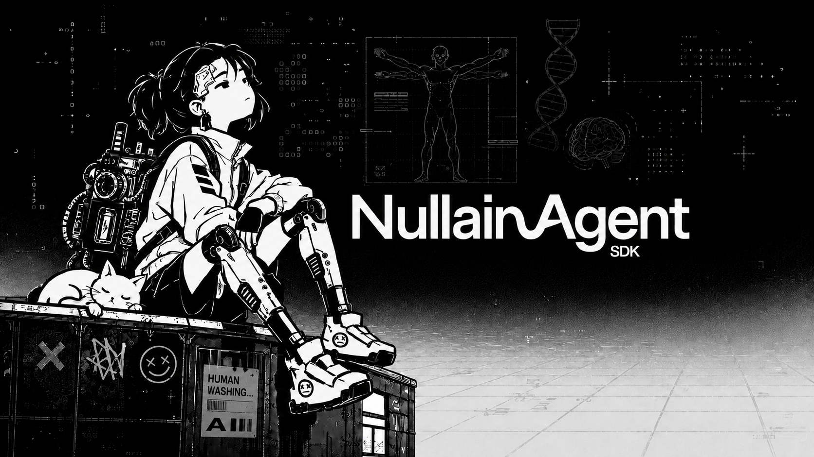
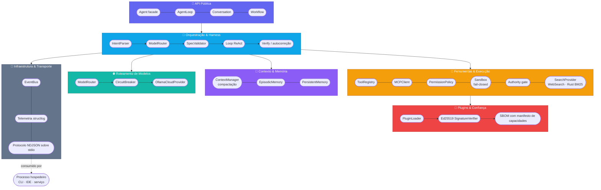

<div align="center">



# Nullain Agent SDK

**O Engine de Agentes Autônomos e SDK para Python, em nível de produção**

[](https://github.com/netty-linux/nullain-agent-sdk/actions/workflows/ci.yml)
[](https://pypi.org/project/nullain-sdk/)
[](https://pypi.org/project/nullain-sdk/)
[](https://github.com/netty-linux/nullain-agent-sdk/blob/master/pyproject.toml)
[](https://www.python.org/downloads/)
[](https://github.com/microsoft/pyright)
[](https://github.com/astral-sh/ruff)
[](docs/architecture.md)
[](LICENSE)

[English](README.md) • **[Português (Brasil)](README.pt-BR.md)**

*Construído para fluxos de engenharia de software de alta confiabilidade. Consumido por qualquer processo hospedeiro — CLI, extensão de IDE, serviço de backend — via protocolo NDJSON sem drift sobre stdio.*

[Visão geral](#-visão-geral) • [Funcionalidades](#-funcionalidades) • [Arquitetura](#-arquitetura) • [Início rápido](#-início-rápido) • [Protocolo & Daemon](#-protocolo--daemon) • [Segurança](#-segurança--modelo-de-ameaças) • [Desenvolvimento](#-desenvolvimento)

</div>

---

## 📌 Visão geral

O **Nullain Agent SDK** (`nullain`) é um engine agêntico de nível de produção capaz de raciocinar, executar código, se autocorrigir e aprender com a experiência ao longo de tarefas de desenvolvimento de software.

É construído sobre **Arquitetura Hexagonal** (ports & adapters) e **Event Sourcing** — cada interação é um evento congelado e append-only, o estado é derivado por fold determinístico, e a fronteira entre "o que o LLM decidiu" e "o que de fato foi executado" é explícita e auditável em cada etapa.

O SDK é distribuído como três pacotes num único workspace:

| Pacote | O que é |
|---|---|
| [`nullain-sdk`](nullain-sdk/) | O engine principal — roteamento de modelos, event sourcing, gestão de contexto, memória, cliente MCP, autoridade de subagentes, plugins, sandboxing e o orquestrador de workflows. |
| [`nullain-tools`](nullain-tools/) | Ferramentas de desenvolvimento embutidas — leitura paginada de arquivos, edições seguras, busca via `ripgrep`, execução de shell, git, checkpoints/undo. |
| [`nullain-agentd`](nullain-agentd/) | Um daemon NDJSON sobre stdio que expõe o SDK para hosts que não são Python (CLIs, extensões de IDE, outros serviços) com um protocolo versionado e exportado como schema. |

### Construído com ele

A **[Nullain Agent](https://github.com/netty-linux/nullain-agent)** é o produto de referência construído sobre este SDK — uma assistente de chat de uso geral (interface web, streaming ao vivo, pagamentos, geração de imagem, RAG, sandbox de código com VNC ao vivo) que consome o `nullain-sdk` como uma dependência PyPI comum.

Vale ler como exemplo prático dos pontos de extensão para os quais este SDK foi desenhado: registrar ferramentas de domínio ao lado das embutidas, sobrescrever a identidade do agente via `SOUL.md`/`AGENTS.md`, controlar ferramentas com efeito colateral por um `permission_callback`, e compartilhar um `PostgresEventStore` entre réplicas. Veja [a seção de arquitetura dela](https://github.com/netty-linux/nullain-agent#-arquitetura) para entender como essas peças se encaixam num deployment real.

---

## ✨ Funcionalidades

- 🧠 **Roteamento de modelos em camadas (`ModelRouter`)**
  A classificação da tarefa roteia requisições para as camadas `fast`, `balanced` ou `deep` na Ollama Cloud, com circuit breakers e cadeias de fallback automáticas.
- 📜 **Event Sourcing imutável (`Conversation`)**
  Todo o histórico de interação é uma sequência congelada e append-only de eventos Pydantic. O estado é derivado via fold determinístico — replicável, sem drift, totalmente auditável.
- 📐 **Loop Plan/Act/Verify (`AgentLoop`)**
  Pipeline estruturado: geração de spec de tarefa, validação estrita, gates de aprovação humana e uma fase de verificação com autocorreção em caso de falha de teste ou lint.
- 🛡️ **Compactação de contexto e centrifugação de instruções (`ContextManager`)**
  Compacta automaticamente o histórico a 75% da capacidade da janela, preservando specs ativas e decisões-chave, com reinjeção de instruções e divulgação progressiva de ferramentas.
- 🧬 **Memória episódica e loop de aprendizado (`EpisodicMemory`)**
  Engine de trajetórias baseado em SQLite que registra tentativas de execução e fingerprints do repositório, injetando exemplos few-shot relevantes em tarefas futuras.
- 🔒 **Segurança em profundidade (`PermissionPolicy` + `Sandbox`)**
  Nunca usa `shell=True` — execução de subprocessos via listas explícitas de argumentos, resolução estrita de caminhos e permissões em 3 níveis (`allow` / `ask` / `deny`). Por baixo disso, um **sandbox de SO fail-closed** (Landlock no Linux ≥5.13, Seatbelt no macOS, Job Object no Windows): se um sandbox exigido não estiver disponível, a execução é **recusada**, nunca roda sem sandbox.
- 🪪 **Lei de interseção de autoridade de subagentes (`Authority`)**
  A autoridade efetiva de um subagente filho é o **encontro** (interseção) de quatro fatores — autoridade do pai ∧ delegação ∧ definição do filho ∧ política. Uma capacidade só é concedida se todos os quatro concederem; qualquer negação isolada a remove por completo, sem escape via `ASK`.
- 📦 **Plugins assinados + SBOM (`PluginLoader`)**
  Plugins são pacotes assinados com manifesto de capacidades. A assinatura cobre identidade, transporte, capacidades, declarações de ferramentas e um SBOM com hash de conteúdo — qualquer desvio em qualquer um deles invalida a assinatura. A verificação é Ed25519, fail-closed em cada ramificação.
- 🔎 **Schemas de ferramentas sob demanda**
  Ferramentas MCP se registram com metadados mínimos; os schemas completos de entrada são carregados sob demanda via uma ferramenta `search_tools`, mantendo o prompt pequeno mesmo com muitas ferramentas disponíveis.
- 🧩 **Orquestrador determinístico de workflows (`Workflow`)**
  Um workflow é uma função Python que compõe subagentes de forma determinística — fan-out, pipelines e ordem são fixados pelo script, nunca decididos por um LLM.
- ⚡ **Daemon NDJSON sobre stdio sem drift (`nullain-agentd`)**
  Um protocolo tipado com exportação automática de JSON Schema (`make schema`), permitindo que qualquer linguagem consuma o SDK sem bindings mantidos manualmente.
- 🌐 **Busca self-hosted e fetch com browser de verdade**
  `web_search` consulta primeiro a sua própria instância [SearXNG](https://docs.searxng.org/) e cai no DuckDuckGo em caso de falha. `web_fetch` pode renderizar páginas pesadas em JavaScript num browser headless real ([Crawl4AI](https://github.com/unclecode/crawl4ai)) e ainda cai no Wayback Machine quando recebe bloqueio anti-bot. Ambos opt-in; sem configuração, o comportamento é o mesmo de antes.
- 🗄️ **Persistência de eventos sem bloquear (`PostgresEventStore`)**
  `append()` enfileira e retorna na hora; um único writer em background drena a fila em lote via `executemany`, tirando as idas ao banco do caminho crítico do loop. As leituras dão flush antes, então o resume de sessão nunca enxerga uma trajetória truncada.
- 📊 **Exportação de spans via OTLP**
  `configure_tracing(exporter="otlp")` envia spans para qualquer backend OTLP/HTTP (Jaeger, Tempo, Honeycomb) respeitando as variáveis padrão `OTEL_EXPORTER_OTLP_*`.
- 🎛️ **Fase de Plan ajustável (`plan_complexity_threshold`)**
  Planejar é o que dá coerência a trabalho multi-arquivo — e é puro custo numa conversa. O threshold (`medium` padrão · `high` · `never`) deixa cada deployment decidir onde a fase de Plan compensa a chamada extra.

---

## 🏗️ Arquitetura



Uma explicação completa do pipeline de execução em seis fases (Intent → Route → Plan → Act → Verify → Memory) está em [docs/architecture.md](docs/architecture.md) (em inglês).

### Sub-SDKs opcionais

Alguns ports oferecem um adapter opcional e mais pesado como extra separado
em vez de dependência obrigatória — a instalação base continua leve, e a
ausência do extra degrada para um fallback documentado em vez de quebrar:

- **Search** — `SearchProvider` (port) tem como padrão sempre disponível o
  `WebSearchProvider` (SearXNG/DuckDuckGo, sem instalação extra) e um índice
  local BM25 opcional em Rust, `RustSearchAdapter`, publicado a partir do
  [nullain-sdk-search](https://github.com/netty-linux/nullain-sdk-search)
  (core em tantivy + bindings PyO3). Instale com
  `pip install nullain-sdk[search-rust]`.

---

## 🚀 Início rápido

### Pré-requisitos

- **Python 3.12+**
- [**uv**](https://github.com/astral-sh/uv) — instalador rápido de pacotes Python
- Uma chave de API do seu provedor de LLM — **[Ollama Cloud](https://ollama.com)** (padrão, modelos open-weight) ou **qualquer endpoint compatível com OpenAI** (OpenAI, OpenRouter, Together, Groq, vLLM, LM Studio, ...). Crie uma conta e gere uma chave, ou simplesmente rode `nullain` sem configuração e o assistente de primeira execução vai perguntar qual provedor usar e pedir a chave.

### Instalar via PyPI

```bash
pip install nullain-sdk
# ou, incluindo os pacotes de ferramentas e daemon:
pip install nullain-sdk nullain-tools nullain-agentd
```

### …ou clonar e rodar a partir do código-fonte

```bash
git clone https://github.com/netty-linux/nullain-agent-sdk.git
cd nullain-agent-sdk
uv sync
export OLLAMA_API_KEY="sua-chave-aqui"   # ou pule — o assistente vai perguntar
```

### CLI

```bash
# Rodar um único prompt
uv run nullain run "liste os arquivos python neste workspace"

# Saída NDJSON estruturada para pipe
uv run nullain run "liste os arquivos python" --json | jq '.type'

# Chat interativo multi-turno com aprovação de permissões via TTY
uv run nullain chat

# Checagens de saúde do ambiente
uv run nullain doctor

# Gerenciar servidores MCP declarados em nullain.toml
uv run nullain mcp list
```

### SDK em Python

A facade `Agent` é o ponto de entrada principal — ela monta o provider, as ferramentas, a política de permissões, o router e o sandbox com padrões seguros:

```python
import asyncio
from nullain import Agent


async def main() -> None:
    agent = Agent(workspace_root=".")
    result = await agent.run(
        "Audite o pyproject.toml e garanta que as dependências estão atualizadas"
    )
    print(result.final_text)


if __name__ == "__main__":
    asyncio.run(main())
```

Para scripts, `run_sync` é uma facade síncrona:

```python
from nullain import Agent

result = Agent(workspace_root=".").run_sync("diga olá")
print(result.final_text)
```

Ou faça streaming dos eventos conforme acontecem:

```python
import asyncio
from nullain import Agent, RunResult


async def main() -> None:
    agent = Agent(workspace_root=".")
    async for item in agent.stream("refatore o carregador de configuração"):
        if isinstance(item, RunResult):
            print(f"\nstatus={item.status} steps={item.steps}")
        else:
            print(f"[{item.event_type}]")


if __name__ == "__main__":
    asyncio.run(main())
```

### Documentação

| Doc | O que contém |
|---|---|
| [docs/quickstart.md](docs/quickstart.md) | Do zero a um agente rodando. |
| [docs/configuration.md](docs/configuration.md) | Cada seção do `nullain.toml`. |
| [docs/tools.md](docs/tools.md) | As ferramentas embutidas e suas capacidades. |
| [docs/tui.md](docs/tui.md) | Como a interface de terminal realmente se parece. |
| [docs/architecture.md](docs/architecture.md) | O pipeline completo de execução e a divisão em camadas. |
| [docs/api-stability.md](docs/api-stability.md) | O que é API pública sob SemVer. |
| [CHANGELOG.md](CHANGELOG.md) | Mudanças relevantes entre versões. |
| [`examples/`](examples/) | Exemplos executáveis: `01_basic_agent.py` … `06_openai_compat_smoke.py`. |

> Nota: os documentos em `docs/` estão em inglês; este README é a referência em português.

### Contribuindo

- [CONTRIBUTING.md](CONTRIBUTING.md) — configuração de dev, fluxo de trabalho, estilo de código.
- [SECURITY.md](SECURITY.md) — como reportar uma vulnerabilidade.
- [CODE_OF_CONDUCT.md](CODE_OF_CONDUCT.md)

---

## 🔄 Protocolo & Daemon

O `nullain-agentd` é a ponte de IPC via stdio entre o SDK e qualquer processo hospedeiro — uma CLI, uma extensão de IDE, um serviço de backend — em qualquer linguagem.

```bash
uv run python -m nullain_agentd.main
```

Cada mensagem é um envelope NDJSON versionado:

```json
{
  "v": 1,
  "type": "user.message",
  "id": "550e8400-e29b-41d4-a716-446655440000",
  "payload": {
    "session_id": "sess_100",
    "prompt": "Crie uma suíte de testes para o módulo de memória"
  }
}
```

O contrato completo é exportado como JSON Schema, para que hosts que não são Python não precisem de bindings mantidos manualmente:

```bash
make schema   # regenera schema/protocol_v1.json
```

---

## 🔒 Segurança & Modelo de ameaças

1. **Isolamento de subprocessos** — nenhuma dependência de `shell=True`; comandos rodam via execução por lista de argumentos, com timeouts e truncamento de saída.
2. **Sandbox de SO fail-closed** — ferramentas de subprocesso rodam dentro de Landlock (Linux ≥5.13), Seatbelt (macOS) ou um Job Object (Windows), isolando sistema de arquivos e rede. Se um sandbox exigido não estiver disponível, a execução é **recusada**, nunca roda sem sandbox.
3. **Contenção de workspace** — operações de arquivo exigem resolução de caminho absoluto verificada contra o `workspace_root`; symlinks são resolvidos antes das checagens de autorização.
4. **Interseção de autoridade de subagentes** — a autoridade efetiva de um filho é o encontro entre pai ∧ delegação ∧ definição do filho ∧ política; qualquer negação isolada remove uma capacidade por completo.
5. **Plugins assinados & SBOM** — a assinatura cobre identidade, transporte, capacidades, declarações de ferramentas e um SBOM com hash de conteúdo; o loader é fail-closed em cada ramificação.
6. **Redação de segredos** — padrões automáticos de redação mantêm chaves de API e credenciais fora de logs e do contexto enviado ao LLM.

> **Uma nota para aplicações host.** O `ASK` vale exatamente o que valer o `permission_callback` por trás dele. Sem callback configurado, `ToolRegistry.execute` nega `ASK` de saída (fail-closed). Um host que fornece um callback assume essa decisão — aprovar indiscriminadamente achata silenciosamente o `ASK` em `ALLOW` para *toda* ferramenta nesse nível, inclusive as registradas depois. Restrinja a aprovação às ferramentas cujo raio de impacto você de fato analisou, e negue o resto.

Encontrou uma vulnerabilidade? Veja [SECURITY.md](SECURITY.md) para saber como reportar de forma responsável.

---

## 🧪 Desenvolvimento

```bash
make check          # lint + typecheck + test — o gate completo
make test            # suíte de testes
make lint             # ruff check
make typecheck    # pyright, modo estrito
make format         # ruff check --fix + ruff format
make audit           # pip-audit para vulnerabilidades conhecidas
make schema        # regenera schema/protocol_v1.json

# Pré-visualizar ou aplicar um bump de versão sincronizado em todo o monorepo
make bump-version VERSION=0.2.0
make bump-version-apply VERSION=0.2.0
```

> **Assinatura de plugins (opcional).** A verificação de assinatura Ed25519 exige o extra `signing`: `uv sync --extra signing` (instala `cryptography`). Sem ele, o SDK instala normalmente e um plugin assinado é recusado fail-closed em vez de carregado por confiança.

---

## 📄 Licença

Este projeto é licenciado sob a [Licença MIT](LICENSE).

<div align="center">

 

**[⬆ Voltar ao topo](#nullain-agent-sdk)**

</div>
